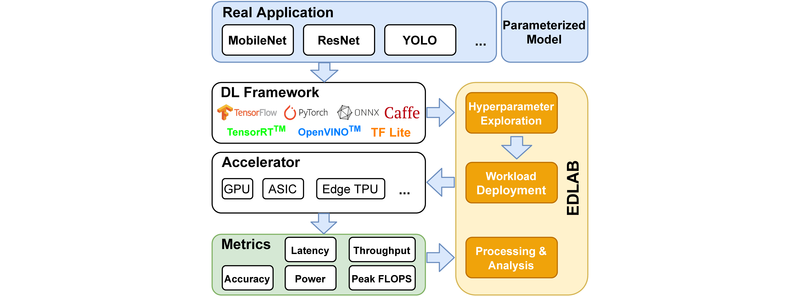

# EDLAB (Edge Deep Learning Accelerator Benchmark)


This is a tool that runs neural networks on different platforms automatically. Until now, we have finished 
testing on the following devices.
- Desktop GPU
- Desktop CPU
- NVIDIA Jetson TX2
- Google Edge TPU
- Intel Neural Compute Stick 2



## How to Use
Clone this tool into your devices (PC, TX2, TPU/NCS2 host, etc.).
``` shell script
git clone https://github.com/ntuliuteam/EDLAB.git
```
Execute the *run.sh* script.
``` shell script
cd ./EDLAB
bash run.sh <devices_name> <model_name>
```
Devices name list can be found in the *run.sh* and  model name list is written down in this [config.properties](config.properties). 
The left term of each model first line is the model short name, which is feed to the *run.sh*.

## Add model
You can add a model to this tool by the following steps.

First, create the folder: EDLAB/models/<model_name>, and put the *frozen.pb* file into this folder.
``` shell script
cd ./EDLAB
mkdir ./models/<model_name>
mv PATH/TO/frozen.pb ./models/<model_name>
```
Second, write the information of this model into [config.properties](config.properties).
```properties
<model_name>="classification/detection"
<model_name>_name="name_of_your_frozen.pb"
<model_name>_dataset="<dataset_name>"
# For classification:
<model_name>_preprocessing="inception/vgg"
<model_name>_labelsoffset="0/1"
```
Last, create the folder: EDLAB/dataset/<dataset_name> and put all images and ground truth in your data set into this folder.
```shell script
cd ./EDLAB
mkdir ./dataset/<dataset_name>
mv PATH/TO/ALLIMGS/* ./dataset/<dataset_name>
mv PATH/TO/GROUND_TURTH ./dataset/<dataset_name>.gtruth
```
## Results
After your command,
```shell script
bash run.sh <devices_name> <model_name>
```
all results will be saved in this [result.csv](result.csv), in which EDP means the energy-delay product and LEDP mean loss-energy-delay product. Loss equals claimed accuracy minus the accuracy we got, which aims to find the accuracy loss of each edge accelerator under the same original model.

The models we provided comes from [here for classification](https://github.com/tensorflow/models/tree/master/research/slim#pre-trained-models) and [here for detection](https://github.com/tensorflow/models/blob/master/research/object_detection/g3doc/detection_model_zoo.md#coco-trained-models), where you can find the claimed accuracy of each model.


The **imagenet_test** data set we provided is the first 5000 images from [IMAGENET_2012](http://image-net.org/) and the **coco2014_test** data set comes from [COCO 14 minival set](https://github.com/tensorflow/models/blob/master/research/object_detection/data/mscoco_minival_ids.txt).


## Project Information

Copyright (c) HP-NTU Digital Manufacturing Corporate Lab, Nanyang Technological University, Singapore.

If you use the tool or adapt the tool in your works or publications, you are required to cite the following reference:
```bib
@article{kong2021edlab,
  title={EDLAB: A Benchmark for Edge Deep Learning Accelerators},
  author={Kong, Hao and Huai, Shuo and Liu, Di and Zhang, Lei and Chen, Hui and Zhu, Shien and Li, Shiqing and Liu, Weichen and Rastogi, Manu and Subramaniam, Ravi and Athreya, Madhu and Lewis, M. Anthony},
  journal={IEEE Design \& Test},
  year={2021},
  publisher={IEEE}
}
```
**Contributors:**
Hao Kong, Shuo Huai, Di Liu, Lei Zhang, Hui Chen, Shien Zhu, Shiqing Li, Weichen Liu, Manu Rastogi (HP), Ravi Subramaniam (HP), Madhu Athreya (HP), M. Anthony Lewis (HP).

If you have any comments, questions, or suggestions please create an issue on github or contact us via email.

Hao Kong Hao <kong [DOT] hao [AT] ntu [DOT] edu [DOT] sg>
